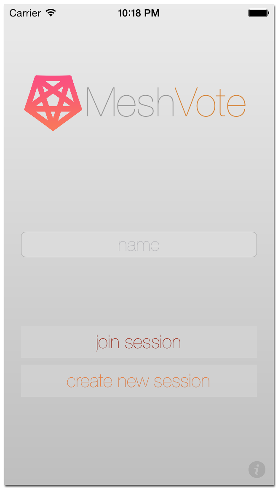

MeshVote
========

MeshVote is a bluetooth powered voting system for iOS 7 and above.  It enables users to host or participate in user-defined polls and displays the results in real time.  MeshVote is especially suited for enviroments where no existing network infrastructure exists (e.g. WiFi or cellular service.)

## How to Use

Taylor Gregston

Copyright 2014