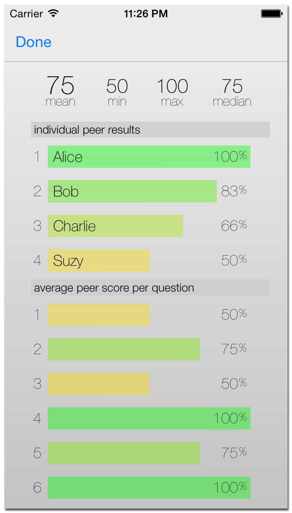
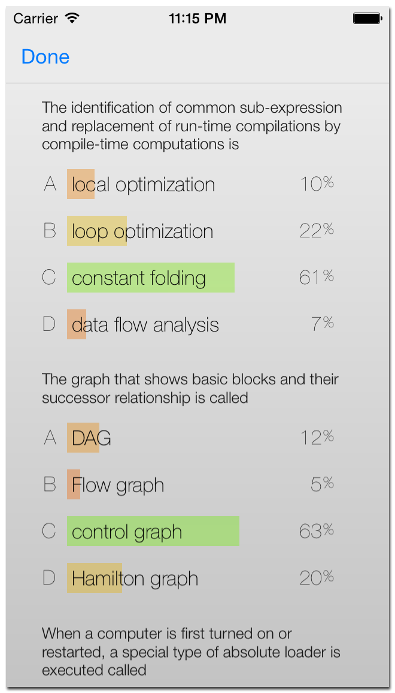

MeshVote
========

MeshVote is a bluetooth powered voting system for iOS 7 and above.  It enables users to host or participate in user-defined polls and displays the results in real time.  MeshVote is especially suited for enviroments where no existing network infrastructure exists (e.g. WiFi or cellular service.)

## Modes of operation

### poll mode
  - host does not supply "correct" answers
  - results will show vote percentages of each answer choice

### quiz mode
  - each question has a "correct" answer
  - results will show overall grade of each peer, along with overall statistics
  - results also show percentage of peers which ansered correctly per question, aloowing the host to see which questions were the toughest

## How to Use

MeshVote has two basic functions:
  - join a poll session, where the user will join an existing poll session being hosted by another peer
  - host a poll session, where the user will define a set of questions to be asked to other peers

### How to join a poll session
  - enter your user name on the home screen and hit "join session". You will be brought to the "Join Session" browser where nearby poll session will appear
  
  

  - from here, you may choose a session to join.  Once connected, you will be ready to tall the poll:
  
  
  
  - when the poll begings, you will be prompted with a series of questions
  
  
  
  - to submit an answer, simply tap your answer choice. Once your answer has succesfully been submitted, a green check mark will appear
  
### How to host a poll session
  - enter your user/session name on the home screen and hit "create new session"
  - create a poll by pressing the + in the upper right hand corner of the screen
  
  

  - from here, you can name your poll, and also select which mode you would like, and whether you should like to share results with the poll takers
  - next, you need to add at least one question to your poll, so click the + on the upper right hand corner, which will bring you to the following screen:

  

  - if you are creating a quiz, you can select which answer is correct by tapping the circle to the right
  - once you have added your questions, you can begin your poll (tip: pull down on the screen to see how many peers are currently connected)
  
  

  - hit the "play" button on the toolbar to begin the poll

  
  
  - while the poll is running, you can see live resuts, as they come in
  - when the poll is finished, you will be prompted will the results summary.  The presentation of the results depends on which mode was selected (ie. poll or quiz)

### Quiz results summary

  

###  Poll results summary
  
  

### Disclaimer

This software provides no warranty.

### Disclaimer to employers

This is my first iOS application.

Taylor Gregston

Copyright 2014
