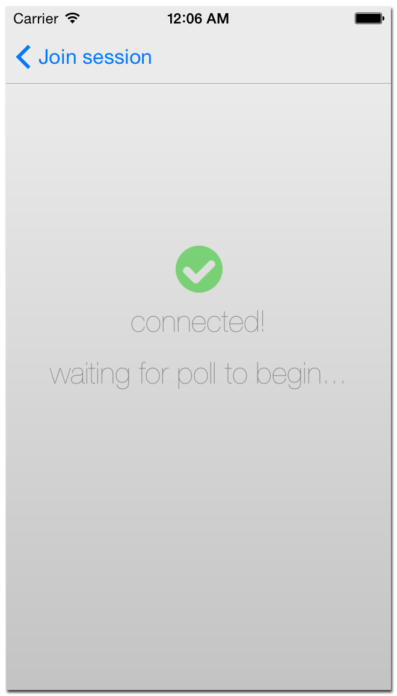

MeshVote
========

MeshVote is a bluetooth powered voting system for iOS 7 and above.  It enables users to host or participate in user-defined polls and displays the results in real time.  MeshVote is especially suited for enviroments where no existing network infrastructure exists (e.g. WiFi or cellular service.)

## How to Use

MeshVote has two basic functions:
  - join a poll session, where the user will join an existing poll session being hosted by another peer
  - host a poll session, where the user will define a set of questions to be asked to other peers

### How to join a poll session
  -enter your user name on the loading screen and hit "join session". You will be brought to the "Join Session" browser where nearby poll session will appear:
  
  From here, you may choose a session to join.  Once connected, you will be ready to tall the poll:
  
  
### How to host a poll session

Taylor Gregston

Copyright 2014
